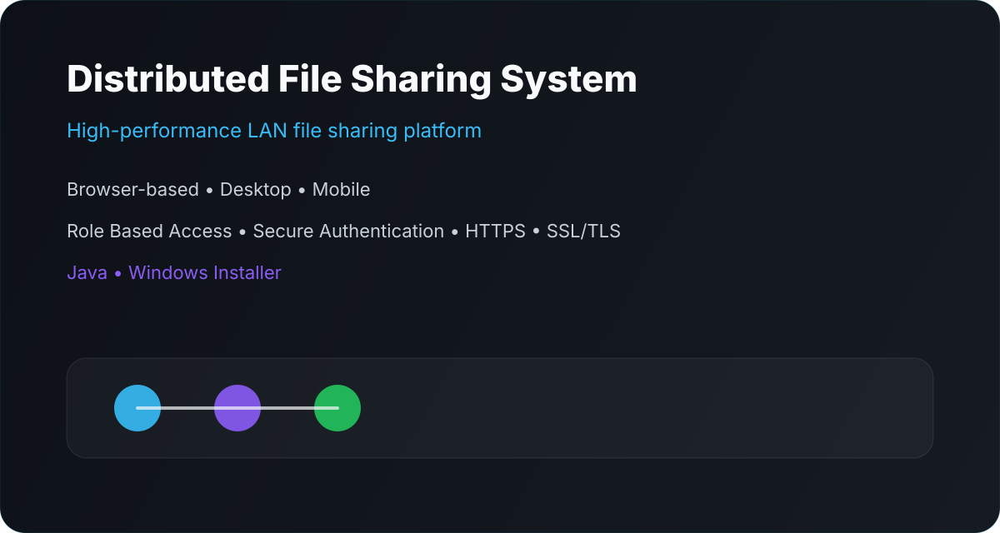
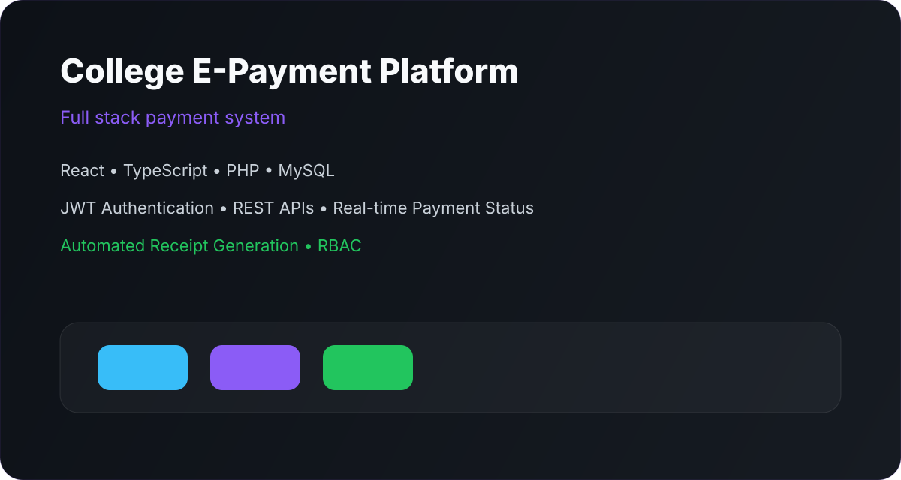
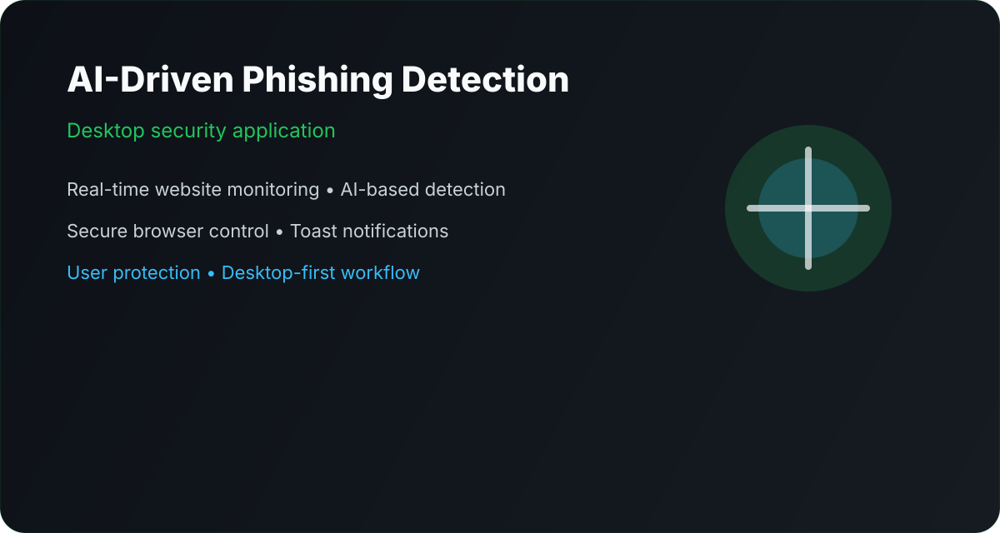

  <picture>
    <source media="(prefers-color-scheme: dark)" srcset="./dark.svg">
    <source media="(prefers-color-scheme: light)" srcset="./light.svg">
    
  </picture>

<h1 align="center">Jashwanth Sai</h1>

  
  
  

---

<!-- ## About Me

I build backend-first systems with a strong bias toward security, clarity, and long-term maintainability. My work sits at the intersection of distributed systems, clean architecture, and AI-assisted products that need to feel fast and dependable.

I am currently studying Computer Science &amp; Engineering at MIT Kundapura while shipping projects that sharpen my engineering depth across backend development, system design, performance tuning, and defensive security.

| Focus               | Description                                                                     |
| ------------------- | ------------------------------------------------------------------------------- |
| Backend Development | Laravel APIs, authentication flows, RBAC, and reliable server-side architecture |
| System Design       | Scalable boundaries, maintainable modules, and performance-aware decisions      |
| Security            | Secure defaults, phishing resistance, HTTPS, SSL/TLS, and access control        |
| AI                  | Practical AI workflows for detection, classification, and user protection       |

--- -->

<!-- ## Current Mission

I am building an AI-driven phishing website detection and secure control access system for desktop users. The goal is simple: detect risky pages in real time, keep users protected while browsing, and present warnings that are immediate, understandable, and hard to ignore.

### What I am optimizing for

- Real-time website monitoring
- AI-based phishing detection
- Secure browser control
- Toast notifications and user-first feedback
- Reliable behavior under normal and hostile conditions

---

## Tech Stack

<table>
  <tr>
    <td valign="top" width="25%">
       <strong>Languages</strong>  
      Java 
      Python 
      C 
      PHP 
      JavaScript 
      HTML5 
      CSS3
    </td>
    <td valign="top" width="25%">
       <strong>Backend</strong>  
      Laravel 
      REST APIs 
      Authentication 
      JWT 
      RBAC 
      PHP
    </td>
    <td valign="top" width="25%">
       <strong>Frontend</strong>  
      React.js 
      Tailwind CSS 
      TypeScript 
      Figma
    </td>
    <td valign="top" width="25%">
       <strong>Database &amp; Tools</strong>  
      MySQL 
      MongoDB 
      Git 
      GitHub 
      VS Code 
      Linux 
      Android Studio
    </td>
  </tr>
</table>

--- -->

<!-- ## Featured Projects

### Distributed File Sharing System

High-performance LAN file sharing platform designed for browser, desktop, and mobile usage.

- Role-based access control
- Secure authentication
- HTTPS and SSL/TLS protection
- Java-based implementation
- Packaged for Windows distribution

### College E-Payment Platform

Full stack payment system for college use with modern authentication and live status feedback.

- React and TypeScript frontend
- PHP backend with MySQL persistence
- JWT authentication
- REST APIs
- Real-time payment status
- Automated receipt generation
- RBAC for controlled access

### AI-Driven Phishing Website Detection &amp; Secure Control Access System

Desktop security application focused on real-time website monitoring and user protection.

- AI-based phishing detection
- Secure browser control
- Toast notifications for instant warnings
- Desktop-first security workflow
- User protection against credential theft

---

## Experience

My experience is built through shipping end-to-end projects rather than collecting disconnected experiments. That has shaped how I think about reliability, performance, and interface clarity.

- Built backend systems with structured authentication and access control
- Designed responsive interfaces that keep critical actions visible
- Developed security-focused flows that prioritize fast user feedback
- Integrated AI-driven detection into practical desktop workflows

---

## Education

**Bachelor of Engineering**  
Computer Science &amp; Engineering  
MIT Kundapura  
2023–2027  
CGPA: 7.9

---

## Certifications

- Machine Learning with Python
- Cloud Computing
- Python
- HTML

--- -->

## GitHub Analytics

  
  

  

<!-- 

  

  

 -->

---

<!-- ## Achievements

- Shipped a secure LAN file-sharing concept with encrypted transport and access control
- Built a college payment platform with live status visibility and automated receipts
- Advanced a phishing-detection desktop application with real-time protection goals
- Maintained a consistent focus on code clarity, performance, and defensive defaults

--- -->

## Contact

  

If you want to collaborate on backend systems, AI security tooling, or product engineering, GitHub is the most direct place to reach me.

---

<!-- ## Project Cards

<table>
  <tr>
    <td></td>
    <td></td>
  </tr>
  <tr>
    <td colspan="2"></td>
  </tr>
</table>

--- -->

  

  Secure Code • Sci-Fi Luxury Design • Intelligent Systems • Continuous Learning

